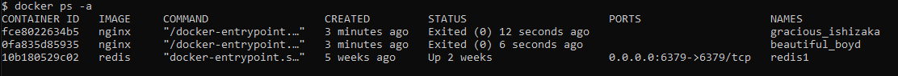
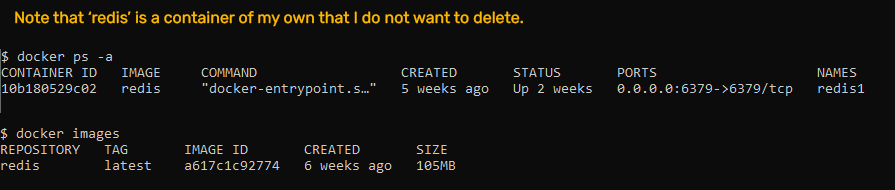
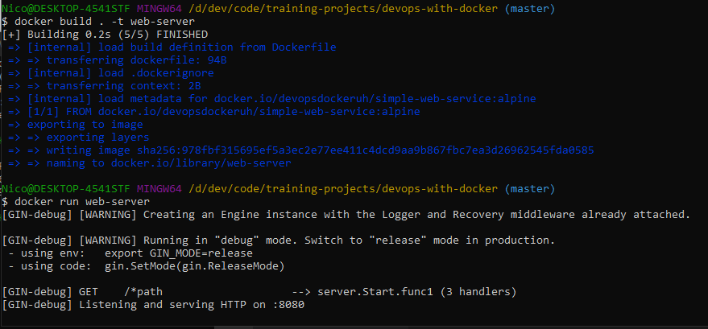
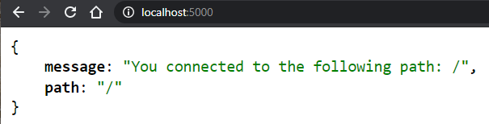
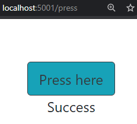
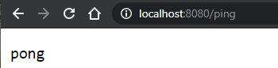
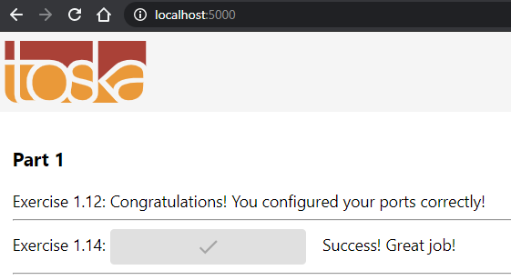

# [PART 1](https://devopswithdocker.com/part1/)


# 1.1



# 1.2



# 1.3

    $ docker run --rm -it --name onepointthree devopsdockeruh/simple-web-service:ubuntu

    Starting log output
    Wrote text to /usr/src/app/text.log
    Wrote text to /usr/src/app/text.log

Separate terminal:

    $ docker exec -it onepointthree bash

    root@4ebb37b6cb03:/usr/src/app# tail -f ./text.log

    2021-05-01 02:50:21 +0000 UTC
    Secret message is: 'You can find the source code here: https://github.com/docker-hy'

# 1.4

    docker run -d --rm -it --name onepointfour ubuntu sh -c 'echo "Input website:"; read website; echo "Searching.."; sleep 1; curl http://$website;'

    docker exec -it onepointfour bash

    root@fb594b1e3801:/# apt-get update; apt-get install curl
    root@fb594b1e3801:/# curl helsinki.fi

Result:

```html
<!DOCTYPE HTML PUBLIC "-//IETF//DTD HTML 2.0//EN">
<html>
  <head>
    <title>301 Moved Permanently</title>
  </head>
  <body>
    <h1>Moved Permanently<h1>
    <p>The document has moved <a href="http://www.helsinki.fi/">here</a>.</p>
  </body>
</html>
```

# 1.5

Check image size:

    $ docker image ls
    REPOSITORY                          TAG       IMAGE ID       CREATED       SIZE
    ubuntu                              latest    7e0aa2d69a15   7 days ago    72.7MB
    alpine                              latest    6dbb9cc54074   2 weeks ago   5.61MB
    devopsdockeruh/simple-web-service   ubuntu    4e3362e907d5   6 weeks ago   83MB
    devopsdockeruh/simple-web-service   alpine    fd312adc88e0   6 weeks ago   15.7MB
    redis                               latest    a617c1c92774   6 weeks ago   105MB

Run container:

    $ docker run --rm -it --name onepointfive devopsdockeruh/simple-web-service:alpine

    Starting log output
    Wrote text to /usr/src/app/text.log

Check secret message functionality:

    $ docker exec -it onepointfive sh
    /usr/src/app # tail -f ./text.log
    2021-05-01 02:18:56 +0000 UTC

    Secret message is: 'You can find the source code here: https://github.com/docker-hy'

# 1.6

    $ docker run -it devopsdockeruh/pull_exercise
    Give me the password: basics

    You found the correct password. Secret message is:
    "This is the secret message"

# 1.7

Dockerfile:

```Dockerfile
FROM devopsdockeruh/simple-web-service:alpine

CMD server
```

Build command, run command and result:



# 1.8

Dockerfile:

```Dockerfile
FROM ubuntu:18.04
WORKDIR /usr/src/app
COPY script.sh .
# chmod is the linux command to change permisions
# chmod +x adds execution permissions (makes the file executable)
RUN chmod +x ./script.sh
RUN apt-get update && apt-get install -y curl
CMD ./script.sh
```

Run command:

    $ docker run -it --rm curler

    Input website:
    helsinki.fi

    Searching..

Result:

```html
<!DOCTYPE html PUBLIC "-//IETF//DTD HTML 2.0//EN">
<html>
  <head>
    <title>301 Moved Permanently</title>
  </head>
  <body>
    <h1>Moved Permanently</h1>
    <p>The document has moved <a href="http://www.helsinki.fi/">here</a>.</p>
  </body>
</html>
```

# 1.9

    docker run -v "$(pwd)/text.log:/usr/src/app/text.log" devopsdockeruh/simple-web-service

# 1.10

    docker run --rm -p:5000:8080 devopsdockeruh/simple-web-service server





# 1.11

Dockerfile:
```Dockerfile
FROM openjdk:8
COPY . .
RUN ./mvnw package
EXPOSE 8080
CMD ["java", "-jar", "./target/docker-example-1.1.3.jar"]
```

Commands:

    docker build . -t spring-project
    docker run -p 5001:8080 spring-project

Result:




# 1.12

Dockerfile:
```Dockerfile
FROM node:latest
WORKDIR /usr/src/app
COPY package*.json ./
RUN npm install
COPY . .
ENV REACT_APP_BACKEND_URL=http://localhost:8080
RUN npm run build
RUN npm install -g serve
EXPOSE 5000
CMD ["serve", "-s", "-l", "5000", "build"]
```

# 1.13

Dockerfile:
```Dockerfile
FROM golang:1.16
WORKDIR /usr/src/app
ENV PORT=8080
ENV REQUEST_ORIGIN=http://localhost:5000
COPY . .
RUN go build
RUN go test ./...
EXPOSE ${PORT}
CMD ["./server"]
```



# 1.14
Frontend Dockerfile:
```Dockerfile
FROM node:latest
WORKDIR /usr/src/app
COPY package*.json ./
RUN npm install
COPY . .
ENV REACT_APP_BACKEND_URL=http://localhost:8080
RUN npm run build
RUN npm install -g serve
EXPOSE 5000
CMD ["serve", "-s", "-l", "5000", "build"]
```

Backend Dockerfile:
```Dockerfile
FROM golang:1.16
WORKDIR /usr/src/app
ENV PORT=8080
ENV REQUEST_ORIGIN=http://localhost:5000
COPY . .
RUN go build
RUN go test ./...
EXPOSE ${PORT}
CMD ["./server"]
```

Commands:

    docker build . -t example-frontend
    docker build . -t example-backend
    docker run --rm -p 5000:5000 --name frontend example-frontend
    docker run --rm -p 8080:8080 --name backend example-backend

Result:


