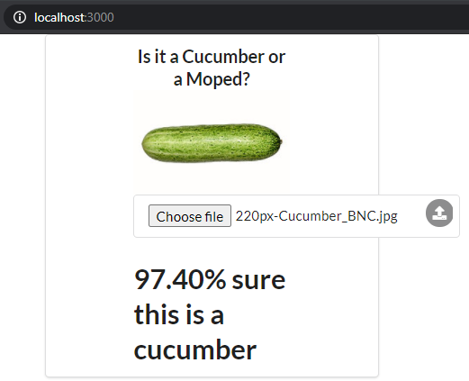

# [PART 2](https://devopswithdocker.com/part2/)

# 2.1

docker-compose.yml:

```yml
version: '3.5'

services:
  simple-web-service:
    image: devopsdockeruh/simple-web-service
    volumes:
      - ./text.log:/usr/src/app/text.log
    container_name: simple-web-service
```

# 2.2

docker-compose.yml:

```yml
version: '3.5'

services:
  simple-web-service:
    image: devopsdockeruh/simple-web-service
    container_name: simple-web-service
    ports:
      - 8080:8080
    command: ['server']
```

# 2.3

docker-compose.yml:

```yml
version: '3.5'

services:
  example-backend:
    image: example-backend
    environment:
      - REQUEST_ORIGIN=http://localhost:5000
    container_name: example-backend
    ports:
      - 8080:8080

  example-frontend:
    image: example-frontend
    environment:
      - REACT_APP_BACKEND_URL=http://localhost:8080
    container_name: example-frontend
    ports:
      - 5000:5000
```

# 2.4

docker-compose.yml:

```yml
version: '3.5'

services:
  example-backend:
    image: example-backend
    environment:
      - REQUEST_ORIGIN=http://localhost:5000
      - REDIS_HOST=example-redis
    container_name: example-backend
    ports:
      - 8080:8080
    depends_on:
      - example-redis

  example-frontend:
    image: example-frontend
    environment:
      - REACT_APP_BACKEND_URL=http://localhost:8080
    container_name: example-frontend
    ports:
      - 5000:5000

  example-redis:
    image: redis
    container_name: example-redis
```

# 2.5

    docker-compose up --scale compute=4

# 2.6

docker-compose.yml:

```yml
version: '3.5'

services:
  example-backend:
    image: example-backend
    environment:
      - REQUEST_ORIGIN=http://localhost:5000
      - REDIS_HOST=example-redis
      - POSTGRES_HOST=example-postgres
      - POSTGRES_PASSWORD=pgsafepw
      # - POSTGRES_USER=postgres # default: postgres
      # - POSTGRES_DATABASE # default: postgres
    container_name: example-backend
    ports:
      - 8080:8080
    depends_on:
      - example-redis
      - example-postgres

  example-frontend:
    image: example-frontend
    environment:
      - REACT_APP_BACKEND_URL=http://localhost:8080
    container_name: example-frontend
    ports:
      - 5000:5000

  example-redis:
    image: redis
    container_name: example-redis

  example-postgres:
    image: postgres
    restart: unless-stopped
    environment:
      POSTGRES_PASSWORD: pgsafepw
    container_name: example-postgres

  example-admirer:
    image: adminer
    restart: always
    ports:
      - 8083:8080
    environment:
      - ADMINER_DESIGN=galkaev
    container_name: example-admirer
```

# 2.7

docker-compose.yml:

```yml
version: '3.5'

services:
  ml-backend:
    build: https://github.com/docker-hy/ml-kurkkumopo-backend.git
    container_name: ml-backend
    ports:
      - 5000:5000
    depends_on:
      - ml-training
    volumes:
      - model:/src/model
    environment:
      - COMPOSE_PROJECT_NAME=ml-backend

  ml-frontend:
    build: https://github.com/docker-hy/ml-kurkkumopo-frontend.git
    container_name: ml-frontend
    ports:
      - 3000:3000
    environment:
      - COMPOSE_PROJECT_NAME=ml-frontend

  ml-training:
    build: https://github.com/docker-hy/ml-kurkkumopo-training.git
    container_name: ml-training
    volumes:
      - imgs:/src/imgs
      - model:/src/model
    environment:
      - COMPOSE_PROJECT_NAME=ml-training

volumes:
  imgs:
  model:
```

Result:



# 2.8

docker-compose.yml:

```yml
version: '3.5'

services:
  example-backend:
    image: example-backend
    container_name: example-backend
    environment:
      - REDIS_HOST=example-redis
      - POSTGRES_HOST=example-postgres
      - POSTGRES_PASSWORD=pgsafepw
    depends_on:
      - example-redis
      - example-postgres

  example-frontend:
    image: example-frontend
    container_name: example-frontend

  example-redis:
    image: redis
    container_name: example-redis

  example-postgres:
    image: postgres
    container_name: example-postgres
    restart: unless-stopped
    environment:
      POSTGRES_PASSWORD: pgsafepw

  example-proxy:
    image: nginx
    container_name: example-nginx
    volumes:
      - ./nginx.conf:/etc/nginx/nginx.conf
    ports:
      - 80:80
    # fix "host not found in upstream" error
    # depends_on:
    #   - example-frontend
    #   - example-backend
```

# 2.9

docker-compose.yml:

```yml
version: '3.5'

services:
  example-backend:
    image: example-backend
    container_name: example-backend
    environment:
      - REDIS_HOST=example-redis
      - POSTGRES_HOST=example-postgres
      - POSTGRES_PASSWORD=pgsafepw

    depends_on:
      - example-redis
      - example-postgres

  example-frontend:
    image: example-frontend
    container_name: example-frontend

  example-redis:
    image: redis
    container_name: example-redis

  example-postgres:
    image: postgres
    container_name: example-postgres
    restart: unless-stopped
    environment:
      - POSTGRES_PASSWORD=pgsafepw
    volumes:
      - ./database:/var/lib/postgresql/data

  example-proxy:
    image: nginx
    container_name: example-nginx
    volumes:
      - ./nginx.conf:/etc/nginx/nginx.conf
    ports:
      - 80:80
```

# 2.10

Buttons from previous exercises were sending requests to `http://localhost` instead of `http://localhost/api`, so I rebuilt the frontend image from exercise 1.14 leaving the default REACT_APP_BACKEND_URL variable value, which is configured to use the /api path by default.

Frontend Dockerfile:

```Dockerfile
FROM node:latest
WORKDIR /usr/src/app
COPY package*.json ./
RUN npm install
COPY . .
# ENV REACT_APP_BACKEND_URL=http://localhost:8080 # Deleted this line
RUN npm run build
RUN npm install -g serve
EXPOSE 5000
CMD ["serve", "-s", "-l", "5000", "build"]
```

The backend Dockerfile remains the same:
```Dockerfile
FROM golang:1.16
WORKDIR /usr/src/app
ENV PORT=8080
ENV REQUEST_ORIGIN=http://localhost:5000
COPY . .
RUN go build
RUN go test ./...
EXPOSE ${PORT}
CMD ["./server"]
```

Re-build the image (could have alternatively overwritten the variable REACT_APP_BACKEND_URL in docker-compose.yml using the `build:` key ):

```
docker build . -t example-frontend:default-backend-url
```

The only change from 2.9 in docker-compose.yml:

```yml
example-frontend:
  image: example-frontend:default-backend-url
  container_name: example-frontend
```

Result:


# 2.11

I am developing a node.js API which uses Redis for user authentication (with sessions).

Since Redis cannot be installed on my Windows system, I create a simple Redis container with Docker and then connect as usual from my backend:

```
  docker run -p 6379:6379 redis
```

In index.ts:
```Typescript
import redis from 'redis';
import session from 'express-session';
import connectRedis from 'connect-redis';

const RedisStore = connectRedis(session);
const redisClient = redis.createClient({
  host: 127.0.0.1, // unnecessary default value
  port: 6379 // unnecessary default value
});
```

