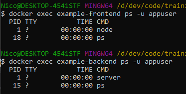

# [PART 3](https://devopswithdocker.com/part3/)


# 3.1

Application deployed in [GitHub](https://github.com/ndeamador/devops-with-docker/tree/master/part3/files/3.1/threepointone) and [Heroku](https://ndeamador-devopsdocker-3-1.herokuapp.com/) (Heroku might take a few seconds to wake up).

GitHub Actions workflow:
```yml
name: 'Deploy to Heroku'

on:
  push:
    branches:
      - master

jobs:
  build:
    runs-on: ubuntu-latest
    steps:
      - uses: actions/checkout@v2

      - name: Build, Push and Deploy to Heroku
        if: ${{ github.event_name == 'push' && contains(github.event.head_commit.message, '#heroku-push')}}
        id: heroku
        uses: akhileshns/heroku-deploy@v3.12.12
        with:
          heroku_email: ${{ secrets.HEROKU_EMAIL }}
          heroku_api_key: ${{ secrets.HEROKU_API_KEY }}
          heroku_app_name: ${{ secrets.HEROKU_APP_NAME }}
          usedocker: true
          rollbackonhealthcheckfailed: true
```

Expected result:


# 3.2

For the sake of simplicity, I have not added error handling, so the program will keep running even if some steps fail.

There is also no credentials helper, so when loggin in to Docker, the password will be stored unencrypted in /root/.docker/config.json.

Shell script (file `3.2.sh`):
```sh
#!/bin/sh

while true
do

echo Enter Github url:
read GITHUB_REPOSITORY
printf "\n"

echo Enter desired repository name in Docker Hub:
read DOCKERHUB_REPOSITORY
printf "\n"

rm -rf workdir

echo Cloning $GITHUB_REPOSITORY...
git clone $GITHUB_REPOSITORY workdir

printf "\n"

docker build ./workdir -t $DOCKERHUB_REPOSITORY
printf "\n"


docker login
printf "\n"

echo Pushing $DOCKERHUB_REPOSITORY to Docker Hub...
docker push $DOCKERHUB_REPOSITORY
rm -rf workdir
printf "\n=================================\n\n"

done
```

Dockerfile:

```Dockerfile
FROM alpine:3.13.5

WORKDIR /usr/src/app

COPY . .

RUN apk add --no-cache git
RUN apk add --update docker

CMD [ "sh", "3-2.sh"]
```

docker-compose.yml:
```yml
version: '3.7'

services:
  publisher:
    image: publisher
    build: .
    # stdin_open: true # docker run -i
    # tty: true        # docker run -t
    container_name: publisher
    volumes:
      - /var/run/docker.sock:/var/run/docker.sock:ro
```

Build and run the image. I use `run` instead of `up` because the latter would not accept user input.
```
docker-compose build
docker-compose run --rm publisher
```

# 3.3
Backend Dockerfile:

```Dockerfile
FROM golang:1.16
WORKDIR /usr/src/app
ENV PORT=8080
ENV REQUEST_ORIGIN=http://localhost:5000
COPY . .
RUN go build
RUN go test ./...
RUN useradd -m appuser

USER appuser

EXPOSE ${PORT}
CMD ["./server"]
```

Frontend Dockerfile:

```Dockerfile
FROM node:latest
WORKDIR /usr/src/app
COPY package*.json ./
RUN npm install
COPY . .

RUN npm run build
RUN npm install -g serve
RUN useradd -m appuser

USER appuser

EXPOSE 5000
CMD ["serve", "-s", "-l", "5000", "build"]
```

Process execution user check:



# 3.4

I was already using language specific base images for golang and node. My initial image sizes are over 1GB so changes under 10MB won't appear. I will instead do a detailed image size breakdown in the next exercise after swapping to Alpine:

Initial image size:
- example-frontend: 1.15GB
- example-backend: 1.01GB


# 3.5

## Backend
### Image size breakdown
- Initial size (golang base image): `1.01 GB`
- Swap to Alpine: `643 MB`
- Add --no-cache to build-base install: `641 MB`
- Group RUN & ENV statements: `641 MB`
- Delete build-base after building: `447MB` (only had an effect with grouped RUN commands.)

Backend Dockerfile:
``` Dockerfile
FROM golang:1.16.4-alpine3.13
WORKDIR /usr/src/app
ENV PORT=8080 \
    REQUEST_ORIGIN=http://localhost:5000
COPY . .
# The first step installs the gcc in order to use golang: https://stackoverflow.com/questions/59471545/when-trying-to-build-docker-image-i-get-gcc-executable-file-not-found-in-p
RUN apk add build-base &&\
    go build &&\
    go test ./... &&\
    adduser -D appuser
    # useradd -m appuser # alpine uses adduser instead.

USER appuser

EXPOSE ${PORT}
CMD ["./server"]
```


## Frontend

### Image size breakdown
- Initial size (node base image): `1.15 GB`
- Swap to alpine: `352 MB`
- Group RUN commands: `352 MB`

Frontend Dockerfile:
```Dockerfile
FROM node:16-alpine3.11

WORKDIR /usr/src/app

COPY package*.json ./
RUN npm install
COPY . .

RUN npm run build && \
    npm install -g serve && \
    adduser -D appuser

USER appuser

EXPOSE 5000
CMD ["serve", "-s", "-l", "5000", "build"]
```


# 3.6

## Frontend
### Image size breakdown
- Previous size (node:alpine base image): `352 MB`
- Multi-stage size: `122 MB`

Dockerfile
```Dockerfile
FROM node:16-alpine3.11 as build-stage
WORKDIR /usr/src/app
COPY package*.json ./
RUN npm install
COPY . .

RUN npm run build

FROM node:16-alpine3.11

WORKDIR /usr/src/app
COPY --from=build-stage /usr/src/app/build ./build

RUN npm install -g serve && \
    adduser -D appuser

USER appuser

EXPOSE 5000
CMD ["serve", "-s", "-l", "5000", "build"]
```

## Backend

### Image size breakdown
- Previous size (golang:alpine base image): `447 MB`
- Multi-stage size: `18 MB` :heavy_check_mark:

Dockerfile
```Dockerfile
FROM golang:1.16.4-alpine3.13 as build-stage

WORKDIR /usr/src/app
COPY . .
ENV CGO_ENABLED=0

RUN apk add --no-cache build-base && \
    go build && \
    go test ./... && \
    apk del build-base  && \
    adduser -D appuser


FROM scratch

WORKDIR /usr/src/app

COPY --from=build-stage /usr/src/app/server ./server
COPY --from=build-stage /etc/passwd /etc/passwd

ENV PORT=8080 \
    REQUEST_ORIGIN=http://localhost:5000

USER appuser

EXPOSE ${PORT}
CMD ["./server"]
```


# 3.7

Initial Dockerfile (`1.23 GB` Image):

```Dockerfile
FROM node:14
WORKDIR /usr/src/game-affinity-project-server
COPY package*.json ./
RUN npm install
COPY . .
RUN npm run build
EXPOSE 4000
CMD ["npm", "start"]
```

Image size breakdown:
* Initial image: `1.23 GB`
* Swap to node:alpine: `399 MB`
* Multi-stage: `191 MB`
* Group RUN statements: `189 MB`

Final Dockerfile:
```Dockerfile
FROM node:16-alpine3.11 AS build-image

WORKDIR /usr/src/gap-server

COPY package*.json ./
RUN npm install
COPY . .

RUN npm run build


FROM node:16-alpine3.11

WORKDIR /usr/src/gap-server
COPY package*.json ./
COPY --from=build-image /usr/src/gap-server/build ./build

RUN npm install --only=prod && \
    npm install --global cross-env && \
    adduser -D appuser

USER appuser
EXPOSE 4000
CMD ["npm", "start"]
```

# 3.8

Kubernetes diagram:


